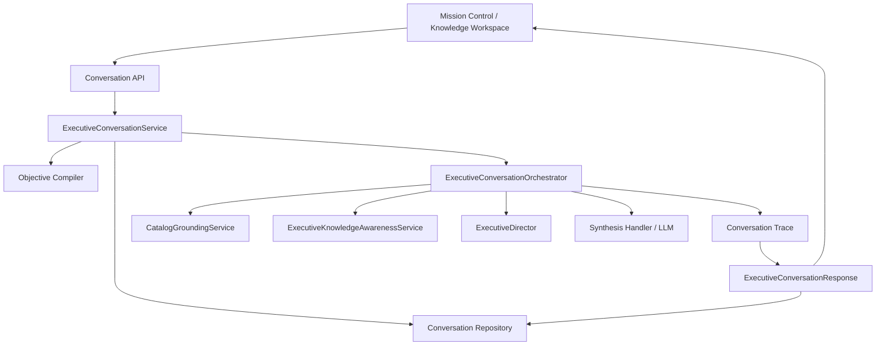

# Genesis IX-A4.1A — Executive Dependency Graph



## Live composition

```json
{
  "ask_signature": "(operator_input: 'str', *, session_id: 'str | None' = None, mode: 'str' = 'full', channel: 'str' = 'text', metadata: 'dict[str, Any] | None' = None) -> 'ExecutiveConversationResponse'",
  "conversation_service": {
    "answer_handler": null,
    "compiler": {
      "module": "core.conversation.compiler",
      "type": "ExecutiveRequestCompiler"
    },
    "module": "core.conversation.service",
    "orchestrator": {
      "module": "core.conversation.orchestrator",
      "type": "ExecutiveConversationOrchestrator"
    },
    "repository": {
      "module": "core.conversation.repository",
      "type": "ConversationRepository"
    },
    "type": "ExecutiveConversationService"
  },
  "orchestrator": {
    "awareness_service": {
      "module": "core.knowledge_awareness.service",
      "type": "ExecutiveKnowledgeAwarenessService"
    },
    "director": {
      "module": "core.executive.director",
      "type": "ExecutiveDirector"
    },
    "grounding_service": {
      "module": "core.conversation.grounding",
      "type": "CatalogGroundingService"
    },
    "module": "core.conversation.orchestrator",
    "observability_service": null,
    "synthesis_handler": {
      "module": "builtins",
      "type": "function"
    },
    "type": "ExecutiveConversationOrchestrator"
  }
}
```

## Executive-facing routes

- `POST /api/conversation/query` → `conversation_query` (`core/src/routes/api.py:82`)
- `GET /api/conversation/sessions/{session_id}` → `conversation_session` (`core/src/routes/api.py:93`)
- `GET /api/conversation/sessions/{session_id}/messages` → `conversation_messages` (`core/src/routes/api.py:101`)
- `POST /ask` → `ask` (`core/src/routes/api.py:74`)
- `GET /bridge` → `commanders_bridge` (`core/src/routes/mission_control.py:13`)
- `GET /bridge` → `executive_bridge_snapshot` (`core/src/routes/operations.py:161`)
- `GET /bridge/manifest` → `executive_bridge_manifest` (`core/src/routes/operations.py:171`)
- `GET /bridge/projections/{projection_id}` → `executive_bridge_projection` (`core/src/routes/operations.py:176`)
- `GET /bridge/readiness` → `executive_bridge_readiness` (`core/src/routes/operations.py:166`)
- `POST /conversation` → `knowledge_workspace_conversation` (`core/src/routes/knowledge_workspace.py:27`)
- `GET /executive` → `operations_executive` (`core/src/routes/operations.py:48`)

## Mission Control consumers

- `POST /api/conversation/query` (http, `core/src/static/mission_control/knowledge_workspace.js:140`)
- `POST /api/knowledge/conversation` (http, `core/src/static/mission_control/knowledge_workspace.js:133`)
