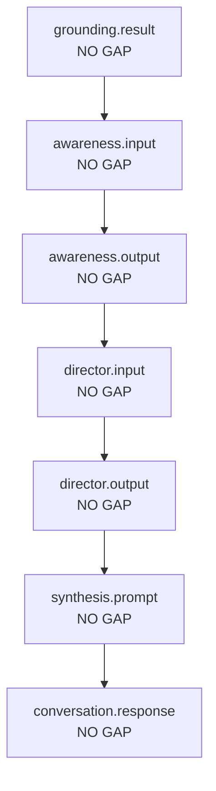

# Knowledge Gap Object Graph

```mermaid
flowchart TD
    N1["grounding.result\nNO GAP"]
    N2["awareness.input\nNO GAP"]
    N3["awareness.output\nNO GAP"]
    N4["director.input\nNO GAP"]
    N5["director.output\nNO GAP"]
    N6["synthesis.prompt\nNO GAP"]
    N7["conversation.response\nNO GAP"]
    N1 --> N2
    N2 --> N3
    N3 --> N4
    N4 --> N5
    N5 --> N6
    N6 --> N7
```

**Verdict:** DATA_DEFECT

Unknown query was classified as 'grounded'; evidence prevented gap creation.
